# Product Requirements Document (PRD)

This PRD lays the groundwork for the DebtFreePlanner by clearly defining the product’s purpose and target audience. The structure and content of this document are guided by the principles and methodologies outlined in [_Design a Better Business: New Tools, Skills, and Mindset for Strategy and Innovation_](https://designabetterbusiness.com/) by Pijl, Lokitz, and Solomon (2016). Additionally, insights from the [Product Mastery Now](https://productmasterynow.com/mastery/) podcast shape the approach, particularly within the "design and development" knowledge area of the "product innovation management" framework.
## Table of Contents
1. [Executive Summary](#1-executive-summary)
2. [Objectives and Key Results (OKRs)](#2-objectives-and-key-results-okrs)
   - 2.1. [Objective 1: Deliver a web-based solution for creating debt repayment plans](#21-objective-1-deliver-a-web-based-solution-for-creating-debt-repayment-plans)
   - 2.2. [Objective 2: Ensure accessibility, usability, and security for all users](#22-objective-2-ensure-accessibility-usability-and-security-for-all-users)
   - 2.3. [Objective 3: Provide comprehensive user education and support features](#23-objective-3-provide-comprehensive-user-education-and-support-features)
3. [Market and Context](#3-market-and-context)
   - 3.1. [Problem Statement](#31-problem-statement)
   - 3.2. [Market Analysis](#32-market-analysis)
     - 3.2.1. [Direct Competitors](#321-direct-competitors)
     - 3.2.2. [Indirect Competitors](#322-indirect-competitors)
     - 3.2.3. [Strategic Opportunities](#323-strategic-opportunities)
   - 3.3. [Assumptions and Limitations](#33-assumptions-and-limitations)
     - 3.3.1. [Assumptions](#331-assumptions)
     - 3.3.2. [Limitations](#332-limitations)
     - 3.3.3. [Risks](#333-risks)
4. [User Profiles](#4-user-profiles)
   - 4.1. [Market Segmentation](#41-market-segmentation)
   - 4.2. [Jobs-to-be-Done (JTBD)](#42-jobs-to-be-done-jtbd)
     - 4.2.1. [Functional Jobs](#421-functional-jobs)
     - 4.2.2. [Emotional Jobs](#422-emotional-jobs)
     - 4.2.3. [Social Jobs](#423-social-jobs)
   - 4.3. [User Pains](#43-user-pains)
   - 4.4. [User Gains](#44-user-gains)
5. [Personas](#5-personas)
   - 5.1. [Taylor, The Debt-Strapped Professional](#51-taylor-the-debt-strapped-professional)
   - 5.2. [Casey, The Organized Homemaker](#52-casey-the-organized-homemaker)
6. [Value Proposition](#6-value-proposition)
   - 6.1. [Feature Set](#61-feature-set)
     - 6.1.1. [Primary Features](#611-primary-features)
     - 6.1.2. [Secondary Features](#612-secondary-features)
     - 6.1.3. [Potential Features](#613-potential-features)
     - 6.1.4. [Excluded Features](#614-excluded-features)
   - 6.2. [Gain Creators](#62-gain-creators)
   - 6.3. [Pain Relievers](#63-pain-relievers)
7. [Value Proposition Canvas](#7-value-proposition-canvas)
8. [User Interface and User Experience (UI/UX)](#8-user-interface-and-user-experience-uiux)
   - 8.1. [User Flows](#81-user-flows)
     - 8.1.1. [Session Management](#811-session-management)
     - 8.1.2. [User Profile](#812-user-profile)
     - 8.1.3. [Debt Plan](#813-debt-plan)
       - 8.1.3.1. [Debt Management](#8131-debt-management)
       - 8.1.3.2. [Snowflake Management](#8132-snowflake-management)
       - 8.1.3.3. [Payment Management](#8133-payment-management)
     - 8.1.4. [Debt Analyst](#814-debt-analyst)
       - 🚧 8.1.4.1. [Advanced Reporting Context](#8141-advanced-reporting-context)
       - 🚧 8.1.4.2. [AI-Driven Insights](#8142-ai-driven-insights)
     - 8.1.5. [Data Management](#815-data-management)
       - 8.1.5.1. [Import Management](#8151-import-management)
       - 8.1.5.2. [Export Management](#8152-export-management)
     - 8.1.6. [PFS Integration Management](#816-pfs-integration-management)
       - 🚧 8.1.6.1. [YNAB Management](#8161-ynab-management)
       - 🚧 8.1.6.2. [Firefly III Management](#8162-firefly-iii-management)
   - 8.2. [Wireframes/Mockups](#82-wireframesmockups)
9. [User Stories](#9-user-stories)
   - 9.1. [User Stories](#91-user-stories)
10. [Legal and Compliance](#10-legal-and-compliance)
   - 10.1. [Data Privacy](#101-data-privacy)
   - 10.2. [Regulatory Compliance](#102-regulatory-compliance)
   - 10.3. [International Regulations](#103-international-regulations)
   - 10.4. [Terms of Service & User Agreements](#104-terms-of-service--user-agreements)
   - 10.5. [Record Keeping and Audit Trails](#105-record-keeping-and-audit-trails)
   - 10.6. [Legal Risk Management](#106-legal-risk-management)
   - 10.7. [Protection of Intellectual Property (IP)](#107-protection-of-intellectual-property-ip)
11. [Related Documents](#11-related-documents)

## 1. Executive Summary

**Product Name:** DebtFreePlanner  
**Product Motto:** Strategically plan your journey to a Debt-Free Living

**Problem Statement**  
Loan recipients struggle to manage debts efficiently, leading to a prolonged financial burden.

**Value Proposition**  
DebtFreePlanner provides loan recipients with a web-based tool to manage debt repayment plans, helping them achieve a Debt-Free Life faster.

**Target Audience**  
 Individuals and families managing multiple loans, especially those who would benefit from an online debt repayment planner with multicurrency support

**Key Objective**
Provide loan recipients with a tool that optimizes their debt repayment plans through informed decision-making.

---

## 2. Objectives and Key Results (OKRs)

### 2.1. Objective 1: Deliver a web-based solution that loan recipients can use to create debt repayment plans.

- **Key Result 2.1.1:** Implement the Snowball, Avalanche, and Highest Monthly Payment strategies.
- **Key Result 2.1.2:** Implement the Debt-to-Interest Ratio, Cash Flow Index (CFI), and custom strategies.
- **Key Result 2.1.3:** Implement Snowflake payments.
- **Key Result 2.1.4:** Implement multicurrency support.
- **Key Result 2.1.5:** Implement basic reporting features.
- **Key Result 2.1.6:** Integrate with financial tools.
- **Key Result 2.1.7:** Implement advanced reporting features.
- **Key Result 2.1.8:** Ensure data portability across different platforms.

### 2.2. Objective 2: Ensure accessibility, usability, and security for all users.

- **Key Result 2.2.1:** Achieve WCAG 2.1 AA compliance for accessibility across all major user interfaces.
- **Key Result 2.2.2:** Implement a responsive design that works seamlessly on mobile, tablet, and desktop devices.
- **Key Result 2.2.3:** Conduct usability testing with at least 10 users and incorporate findings into the final design.
- **Key Result 2.2.4:** Implement security features, including user authentication and data encryption.
- **Key Result 2.2.5:** Ensure GDPR compliance for data handling and user privacy.

### 2.3. Objective 3: Provide comprehensive user education and support features.

- **Key Result 2.3.1:** Develop an in-app tutorial or onboarding guide for new users.
- **Key Result 2.3.2:** Create a help center with FAQs, user guides, and video tutorials.
- **Key Result 2.3.3:** Implement in-app tooltips and contextual help for key features.
- **Key Result 2.3.4:** Collect and analyze user feedback to improve educational materials in future iterations.

---

## 3. Market and Context

### 3.1. Problem Statement

Loan recipients struggle to manage multiple debts, leading to prolonged financial strain. This challenge arises from a lack of tools and knowledge that support practical debt management strategies such as Snowball, Avalanche, and Snowflake, as well as multicurrency support.

### 3.2. Market Analysis

#### 3.2.1. Direct Competitors

Direct competitors like [Debt Payoff Planner](https://www.debtpayoffplanner.com/), [Undebt.it](https://undebt.it/), [unbury.me](https://unbury.me/), and [Vertex42 Debt Reduction Calculator](https://www.vertex42.com/Calculators/debt-reduction-calculator.html) help users manage and pay down debt using strategies like Snowball and Avalanche. However, these tools lack multicurrency support and the ability to customize debt repayment plans as extensively as DebtFreePlanner.

#### 3.2.2. Indirect Competitors

Indirect competitors such as [Mint](https://www.mint.com/), [YNAB](https://www.youneedabudget.com/), [Quicken](https://www.quicken.com/), [Personal Capital](https://www.personalcapital.com/), and [Simplifi](https://www.quicken.com/simplifi) offer a broad range of financial management features, including budgeting and expense tracking, but do not support creating debt repayment plans.

#### 3.2.3. Strategic Opportunities

1. **Multicurrency Support**: None of the direct competitors offer multicurrency support or localization. DebtFreePlanner addresses this gap, making it uniquely suited for a global user base and providing a significant advantage in catering to diverse financial needs across different regions.

2. **AI-Driven Insights**: The use of AI for personalized recommendations and predictive analytics is an emerging area that none of the competitors have yet to fully embrace. While AI-driven insights are currently not on the roadmap, if implemented, DebtFreePlanner would be the first in the market to offer such advanced functionality, further solidifying its position as an innovative leader in debt management.

3. **API Integrations**: YNAB offers a well-documented official API that can be used to pull loans into DebtFreePlanner. This integration can be leveraged to create a symbiotic relationship, enhancing the overall user experience and data synchronization between the two tools.

### 3.3. Assumptions and Limitations

#### 3.3.1. Assumptions

- **Basic Financial Literacy:** Users have a basic understanding of financial concepts, such as compound interest and loan terms.
- **Basic Technology Proficiency:** Users are comfortable using online banking and personal finance apps.
- **Basic Computer Setup:** The application is primarily used on a laptop with an internet connection.
- **Data Accuracy:** Users will input correct financial information to ensure accurate calculations.

#### 3.3.2. Limitations

- **Data Privacy:** In addition to standard data privacy measures, DebtFreePlanner must implement GDPR and CCPA.
- **Platform Limitations:** DebtFreePlanner is designed as a web-based tool, which may limit its functionality on certain devices or when used offline.

#### 3.3.3. Risks

- **External Service Dependency Risks:** The tool may face challenges with the integration and reliability of third-party APIs and services.
- **Public Repository Exposure:** Because this is a portfolio project, the repository is public, increasing the likelihood of a successful cyberattack.
- **Attractiveness as a Target:** Since the app manages financial data, it is an attractive target (honeypot) for cybercriminals.

---

## 4. User Profiles

### 4.1. Market Segmentation
DebtFreePlanner targets retail loan recipients who are motivated to pay off their debts efficiently. This audience includes [established professionals managing significant debt loads](#51-taylor-the-debt-strapped-professional) and [younger individuals focused on building a stable financial future](#52-casey-the-organized-homemaker).

### 4.2. Jobs-to-be-Done (JTBD)

#### 4.2.1. Functional Jobs
 - Identify the most beneficial debt repayment strategy.
 - Minimize the total interest paid across all debts.
 - Estimate the timeline for becoming completely debt-free.
 - Automatically update amounts in foreign currencies using up-to-date exchange rates.
 - Export data for external manipulation and re-import it.

#### 4.2.2. Emotional Jobs

- Be empowered and in control of financial future.
- Gain peace of mind by having a clear path to becoming debt-free.
- Reduce stress and anxiety by providing practical guidance on managing multiple debts.

#### 4.2.3. Social Jobs

- Enhance financial reputation among peers and loved ones.
- Serve as a financial role model influencing financial behaviors.

### 4.3. User Pains

- Lack of clarity and confidence in devising an effective debt repayment strategy.
- Persistent anxiety and stress due to the uncertainty of managing multiple debts.

### 4.4. User Gains

- Gain control over finances with clear, actionable repayment plans.
- Integrates with budgeting tools like YNAB for a seamless data entry.
- Achieving financial independence by becoming debt-free within a reasonable time frame.

---

## 5. Personas

> **Note:** At a later stage, we will create a user persona in [Figma](https://www.figma.com/community/search?resource_type=files&sort_by=relevancy&query=user+persona).

## 5. Personas

> **Note:** At a later stage, we will create a user persona in [Figma](https://www.figma.com/community/search?resource_type=files&sort_by=relevancy&query=user+persona).

### 5.1. Taylor, The Debt-Strapped Professional

- **Age:** Millennial (Gen Y)
- **Occupation:** Mid-Level Manager in IT
- **Economic Status:** Upper Middle Class
- **Region:** Western Europe
- **Financial Status:** Struggling with cash flow despite a comfortable income

- **Jobs to Be Done:**
  - Identify the most beneficial debt repayment strategy.
  - Minimize the total interest paid across all debts.
  - Automatically update loan in foreign currencies.
  - Estimate the timeline for becoming completely debt-free.

- **Pains:**
  - Lack of clarity and confidence in prioritizing debt payments.
  - Persistent stress and anxiety due to uncertainty in managing multiple debts.
  - Difficulty in finding practical tools to streamline debt management.
  - The burden of manually converting foreign currency loans to the base currency.

- **Gains:**
  - Regaining control over finances with clear, actionable repayment plans.
  - Achieving financial independence by becoming debt-free within a reasonable time frame.
  - Seamless integration with budgeting tools like YNAB for efficient data management.

- **Behavior:**
  - Recently started using YNAB to manage personal finances.
  - Strapped for time, so prefers solutions that integrate well and just works.
  - Prefers using financial tools on a laptop but occasionally uses mobile devices for quick checks.

- **Needs:**
  - A tool that provides clear guidance on debt prioritization and repayment strategies.
  - Ability to manage debts in multiple currencies.
  - Features that minimize interest paid and accurately project debt-free dates.
  - Seamless integration with existing budgeting tools like YNAB.

- **Quote:** "I want to be in control of my finances, not the other way around."

### 5.2. Casey, The Organized Homemaker

- **Age:** Generation Z
- **Occupation:** Stay-at-Home Parent
- **Economic Status:** Middle Class
- **Region:** North America
- **Financial Status:** In debt but managing

- **Jobs to Be Done:**
  - Manage multiple loans while balancing household expenses.
  - Minimize the total interest paid across all debts.
  - Optimize loan payments to improve cash flow.

- **Pains:**
  - Overwhelm and stress from juggling multiple loans and household expenses.
  - Uncertainty in how to effectively manage debt repayment alongside daily financial obligations.
  - Anxiety over financial decisions impacting the family's long-term security.

- **Gains:**
  - Reducing financial stress and achieving financial freedom for the family.
  - Successfully managing debts to save for a home down payment.
  - Using a tool that integrates with other financial tools, providing clear insights into interest savings and payment strategies.

- **Behavior:**
  - Regularly uses an online banking app to monitor spending and manage finances.
  - Maintains the household budget in Excel.
  - Is very privacy-focused and prefers doing things manually to maintain a sense of control.
  - Is very budget-conscious and actively seeks out deals and discounts.

- **Needs:**
  - A streamlined tool to manage and optimize loan payments, providing clear insights into interest savings from additional payments.
  - The ability to project future loan payments and visualize the impact of different payment strategies.

- **Motivations:**
  - Seeks to reduce financial stress by managing debts efficiently and ensuring the family's financial stability.
  - Aims to achieve financial freedom and security for the family.
  - Values simplicity, reliability, and transparency in financial tools.

- **Quote:** "I need a tool that helps me see the bigger picture so that I can ensure our family's financial well-being in the long term."

## 6. Value Proposition

DebtFreePlanner offers a web-based solution that loan recipients can use to create a debt repayment plans that accelerate their journey to financial freedom.

### 6.1. Feature Set

#### 6.1.1. Primary Features

- **Multiple Repayment Strategies**
  - Supports a variety of debt repayment methods, including Snowball, Avalanche, Debt-to-Interest Ratio, Cash Flow Index (CFI), Highest Monthly Payment, and Custom Strategies.

- **Snowflake Payments**
  - Enables small, irregular payments towards debts whenever extra funds are available, helping to reduce the principal faster.

- **Multicurrency Support**
  - Provides seamless handling of multiple currencies with automatic exchange rate updates, catering to a global user base.

- **Basic Reporting**
  - Generates essential reports and visualizations to help loan recipients understand and track their repayment plans.

- **Secure Data Handling:**
   - The application ensures that all sensitive user data is encrypted both at rest and in transit.

#### 6.1.2. Secondary Features

- **Data Portability:**
   - Users can export and import their data, allowing them to maintain control over their information and use it in other financial tools or reports.

- **Integration with Financial Tools**
  - Synchronizes with budgeting applications like YNAB and possibly Firefly III for seamless data management.

- **Advanced Reporting**
  - Offers enhanced reporting and visualizations that incorporate data storytelling techniques to provide deeper insights.

- **Multiple Plan Support**: Users can create and manage multiple debt repayment plans, each with its own strategy and set of debts. This feature allows for the separate management of different financial goals or scenarios.

- **Multi-User Support**:
  - Users can invite others to collaborate on specific debt repayment plans, granting them either read-only or write permissions.
  - Admins can manage user roles within each plan, including the ability to revoke access or elevate users to admin status..

#### 6.1.3. Potential Features
The following features are under consideration for future development but are not yet confirmed or scheduled for implementation.

- **AI-Driven Insights**
  - Provides personalized recommendations and predictive analytics to optimize repayment strategies.

- **Cross-Platform Accessibility**
  - Ensures accessibility across multiple devices, enhancing usability and engagement wherever the user is.

#### 6.1.4. Excluded Features
To ensure DebtFreePlanner remains focused on fulfilling its intended purpose, the following features and functionalities were deemed unviable due to the complexity of their implementation or specific market needs.

- **Budgeting and Expense Tracking**
  - DebtFreePlanner will not include general budgeting or expense tracking features, including loan payment history tracking. These functionalities are excluded because many established applications already perform them well, and these features are complementary rather than central to the problem DebtFreePlanner is addressing. Users are encouraged to use tools like YNAB (You Need A Budget) or Firefly III, which may be integrated with DebtFreePlanner in the future.

- **Non-Conventional Loan Types**
  - DebtFreePlanner will only support the most common loan types (e.g., mortgages, student loans, and credit card debt). Non-conventional loan types, such as payday loans, interest-only loans, or cryptocurrency loans, are not supported due to a lack of market demand.

- **Advanced Loan Features**
  - Advanced loan features, such as variable interest rates and early termination fees, are out of scope due to the complexity of accommodating all possible business rules of financial institutions. Users will need to update loan terms manually when they change.

- **Business-Oriented Features**
  - DebtFreePlanner will not offer features intended primarily for business owners, given that large businesses would likely not trust this tool, and features targeting personal finances can typically meet the needs of small business owners.

### 6.2. Gain Creators

- Reduce interest payments, accelerating the journey to financial independence.
- Provide clear, actionable insights to improve financial health.

### 6.3. Pain Relievers

- Simplify the process of managing multiple debts, reducing financial stress.
- Integrate with existing financial tools for a seamless user experience.

---

## 7. Value Proposition Canvas

> **Note:** At a later stage, we will create a Value Proposition Canvas in [Figma](https://www.figma.com/community/search?resource_type=mixed&sort_by=relevancy&query=Value+Proposition+Canvas).

### 7.1.  Value Proposition Canvas
ValuePropositionCanvas.png

---

### User Interface and User Experience (UI/UX)

### 8.1. User Flows

> **Key Map:**
- **Arrow**: Indicates the sequence or direction of flow.
- **Capsule/Pill**: Represents the start or end of a process, or the initiation of a different user flow.
- **Square**: Denotes a specific task or process within the flow.
- **Input Square**: Represents an input operation, typically user-provided data.
- **Output Square**: Represents an output operation, such as displaying results.
- **Diamond**: Represents a decision point where the user may be presented with options or branching paths.

```plantuml:
@startuml
title Key Map

: Represents the start or end of flow;
: Represents a task or procedure; <<task>>
: Represents an input operation; <<input>>
: Represents an output operation; <<output>>

if (Represents a decision point) then (Yes)
  :Process Action 1; <<task>>
else (No)
  :Process Action 2; <<task>>
endif
@enduml
```

---

### 8.1.1. **Session Management:**

### 8.1.1. **User Session**

**Purpose:** This flow outlines how users navigate the authentication process, ensuring a smooth and secure login experience.

- **8.1.1.1. Single-User Context:** Focuses on managing individual user sessions, including login, logout, and maintaining session continuity.

```plantuml:
@startuml
title User Login Process

start
:Open Application;

while (Is user logged in?) is (No)
  if (User has account?) then (Yes)
    
    if (Will log in via Identity Provider?) then (Yes)
      :Redirect to Identity Provider; <<task>>
    else (No)
      :Enter Email and Password; <<input>>
    endif

    :Process Login; <<task>>
    if (Authentication Successful?) then (Yes)
      :Display Welcome Message; <<output>>
    else (No)
      :Show Error Message; <<output>>
    endif

  else (No)
    :Choose Sign Up Method; <<task>>

    if (Sign Up via Identity Provider?) then (Yes)
      :Redirect to Identity Provider; <<task>>
    else (No)
      :Enter Email, Password, and Confirm Password; <<input>>
      :Process Sign Up Form; <<task>>
      :Confirmation Email Sent; <<output>>
      :Click Confirmation Link; <<input>>
    endif
    
    if (Is account created?) then (Yes)
      :Show Account Created; <<output>>
    else (No)
      :Show Error Message; <<output>>
    endif
  endif

endwhile (Yes)

:Grant Access; <<task>>
stop
@enduml
```

- **8.1.1.2. 🚧 Multi-User Context:** Expands to manage multiple user sessions under a single account, supporting role-based access control and seamless switching between user profiles.

```plantuml:
@startuml
title User Login Process (Multi-User with Plan Selection)

start
:Open Application;

while (Is user logged in?) is (No)
  if (User has account?) then (Yes)
    
    if (Will log in via Identity Provider?) then (Yes)
      :Redirect to Identity Provider; <<task>>
    else (No)
      :Enter Email and Password; <<input>>
    endif

    :Process Login; <<task>>
    if (Authenticated successfully?) then (Yes)

      if (Has Multiple Plans?) then (Yes)
        :User chooses their plan; <<input>>
      else (No)
    endif

    else (No)
      :Show Error Message; <<output>>
    endif

  else (No)
    :Choose Sign Up Method; <<task>>

    if (Sign Up via Identity Provider?) then (Yes)
      :Redirect to Identity Provider; <<task>>
    else (No)
      :Enter Email, Password, and Confirm Password; <<input>>
      :Process Sign Up Form; <<task>>
      :Confirmation Email Sent; <<output>>
      :Click Confirmation Link; <<input>>
    endif

    if (Is account created?) then (Yes)
      :Show Account Created; <<output>>
    else (No)
      :Show Error Message; <<output>>
    endif
  endif

endwhile (Yes)

:Grant Access; <<task>>
stop
@enduml

@enduml
```

**Implemented under module:** Session Management

---

### 8.1.2. **User Profile**

**Purpose:** This flow allows users to manage their personal information and account settings, ensuring a personalized and consistent experience across the application.

- **8.1.2.1. Single-User Context:** Supports the management of personal data, preferences, and settings for a single user.
- **8.1.2.2. 🚧 Multi-User Context:** Extends to manage multiple profiles within a single account, facilitating role assignment, profile switching, and permissions management.

**Implemented under module:** Profile Management

---

### 8.1.3. **Debt Plan**

**Purpose:** Centralized flow for managing debt repayment plans, enabling users to create, modify, and monitor their debt reduction strategies.

- **8.1.3.1. Debt Management:** Focuses on managing individual debts, including loan amounts, interest rates, and repayment terms.

  **Implemented under module:** Debt Management

- **8.1.3.2. Snowflake Management:** Manages irregular payments (snowflake payments) to help users reduce their debt faster.

  **Implemented under module:** Snowflake Management

- **8.1.3.3. Payment Management:** Manages the overall allocation of payments across debts, ensuring users stay on track with their repayment goals.

  **Implemented under module:** Payment Management

---

### 8.1.4. **Debt Analyst**

**Purpose:** Provides users with insightful reports and visualizations to track their debt repayment progress, enabling informed decision-making and maintaining motivation.

- **Basic Reporting Context:** Delivers standard reports that help users monitor their debt reduction efforts.
- **🚧 Advanced Reporting Context:** Offers enhanced reporting capabilities with deeper insights and sophisticated visualizations, allowing users to drill down into their debt repayment data.
- **🚧 AI-Driven Insights:** Leverages AI to provide users with personalized recommendations and predictive analytics, helping them optimize their debt repayment strategies.

**Implemented under module:** Reporting Management

---

### 8.1.5. **Data Management**

**Purpose:** Manages the processes for importing and exporting user data, ensuring that users have full control over their information.

- **8.1.5.1. Import Management:** Facilitates the importing of data from external sources, ensuring that users can seamlessly integrate external financial data.
- **8.1.5.2. Export Management:** Allows users to export their data for use in other financial tools or for backup, ensuring data portability and user control.

**Implemented under module:** Data Management

---

### 8.1.6. **PFS Integration Management**

**Purpose:** Manages the integration of the application with external personal finance software (PFS), allowing users to synchronize their data for a more comprehensive financial overview.

- **🚧 8.1.6.1. YNAB Management:** Handles integration with YNAB, allowing users to import or export budget data.
- **🚧 8.1.6.2. Firefly III Management:** Manages the connection with Firefly III, enabling data synchronization between the two platforms.

**Implemented under module:** Integration Management

---

> **🚧 Note:** Features marked with 🚧 are still under consideration and have not yet been added to the roadmap. The diagrams for these features are rough drafts or do not exist. If the feature is ultimately included, it will be further detailed in this document; otherwise, it will be removed.

### 8.2. Wireframes/Mockups

- **Dashboard:** Displays key metrics, repayment progress, and quick actions.
- **Plan Creation:** Forms for entering debt details and selecting repayment strategies.
- **Plan Customization:** Interface for adjusting repayment priorities and adding extra payments.
- **Progress Tracking:** Visual representations of repayment progress and milestones.

## 9. User Stories

User stories should be:

- User-Centric Focus
- INVEST Criteria
- Have an Acceptance Criteria
- Prioritization

### 9.1. User Stories

- **As a user, I want to create a debt repayment plan using the Snowball strategy so that I can pay off my smallest debts first and gain motivation.**
- **As a user, I want to see a summary of my debt repayment progress so that I can track my achievements and stay motivated.**
- **As a user, I want to customize my repayment plan by adding extra payments so that I can pay off my debts faster.**
- **As a user, I want to import my financial data from external accounts so that I don't have to manually enter all my debt information.**

---

## 10. Legal and Compliance

### 10.1. Data Privacy

- **Overview**: Outline the commitment to protecting user data and complying with relevant data privacy regulations.
- **Key Regulations**:
  - **GDPR (General Data Protection Regulation)**: Describe how the product will ensure compliance with GDPR, including data collection, processing, storage, and user rights.
  - **CCPA (California Consumer Privacy Act)**: Outline how the product will meet CCPA requirements, focusing on consumer rights to privacy and data protection.
- **User Rights**:
  - **Data Access**: Explain how users will be able to access their data.
  - **Data Deletion**: Describe the process for users to request the deletion of their data.
  - **Data Portability**: Outline the mechanisms for providing users with their data in a portable format.

### 10.2. Regulatory Compliance

- **Industry-Specific Regulations**:
  - **Financial Regulations**: If applicable, discuss any financial regulations that must be adhered to, such as anti-money laundering (AML) or Know Your Customer (KYC) guidelines.
  - **Health Regulations**: If the product deals with health data, outline compliance with regulations like HIPAA (Health Insurance Portability and Accountability Act).
- **Compliance Monitoring**: Describe how ongoing compliance will be monitored and maintained throughout the product lifecycle.
- **Audit and Reporting**: Explain any auditing mechanisms that will be in place to ensure compliance and to report on compliance status.

### 10.3. International Regulations

- **Global Compliance Strategy**:
  - Describe the approach to ensuring the product complies with legal requirements in all countries where it will be available.
- **Local Data Privacy Laws**:
  - Highlight any country-specific data privacy laws that go beyond GDPR and CCPA, and how the product will adhere to these regulations.
- **Cross-Border Data Transfers**:
  - Discuss how data will be handled when transferring across borders, particularly in compliance with regulations like GDPR's data transfer restrictions.

### 10.4. Terms of Service & User Agreements

- **User Agreements**:
  - Outline the key terms that will be included in the end-user agreements, such as acceptable use policies, limitations of liability, and dispute resolution processes.
- **Terms of Service**:
  - Provide an overview of the terms of service that users must agree to when using the product. This should include disclaimers, intellectual property notices, and the governing law.

### 10.5. Record Keeping and Audit Trails

- **Record Keeping Requirements**:
  - Detail the types of records that must be maintained for compliance purposes, including user consent records, transaction logs, and access records.
- **Audit Trails**:
  - Describe how audit trails will be maintained to track access to sensitive data, changes in data, and compliance with regulatory requirements.
- **Retention Policies**:
  - Explain the data retention policies, including how long different types of data will be stored and when they will be purged or anonymized.

### 10.6. Legal Risk Management

- **Risk Identification**:
  - Identify potential legal risks associated with the product, such as non-compliance with data privacy laws, intellectual property disputes, or liability issues.
- **Mitigation Strategies**:
  - Outline strategies to mitigate identified risks, including insurance, legal reviews, and contingency plans.
- **Legal Reviews**:
  - Describe the process for regular legal reviews of the product to ensure ongoing compliance with evolving laws and regulations.

### 10.7. Protection of Intellectual Property (IP)

- **Overview**:
  - Describe the steps that will be taken to protect the intellectual property associated with the product, particularly in preparation for potential monetization.
- **Patents**:
  - Discuss any patentable inventions or processes that are part of the product and outline the strategy for securing patents.

---

## 11. Related Documents

- [Product Requirements Document (PRD)](<https://github.com/Guilderm/DebtFreePlanner/blob/main/Documents/Product%20Requirements%20Document%20(PRD).md>)
- [Software Requirements Specification (SRS)](<https://github.com/Guilderm/DebtFreePlanner/blob/main/Documents/Software%20Requirements%20Specification%20(SRS).md>)
- [Software Design Document (SDD)](<https://github.com/Guilderm/DebtFreePlanner/blob/main/Documents/Software%20Design%20Document%20(SDD).md>)
- [Software Test Document (STD)](<https://github.com/Guilderm/DebtFreePlanner/blob/main/Documents/Software%20Test%20Document%20(STD).md>)
- [User Guide](https://github.com/Guilderm/DebtFreePlanner/blob/main/Documents/User%20Guide.md)
- [Architecture Decision Record (ADR)](<https://github.com/Guilderm/DebtFreePlanner/blob/main/Documents/Architecture%20Decision%20Record%20(ADR).md>)
- [README](https://github.com/Guilderm/DebtFreePlanner/blob/main/README.md)
- [Shared Appendix](https://github.com/Guilderm/DebtFreePlanner/blob/main/Documents/Shared%20Appendix.md)
