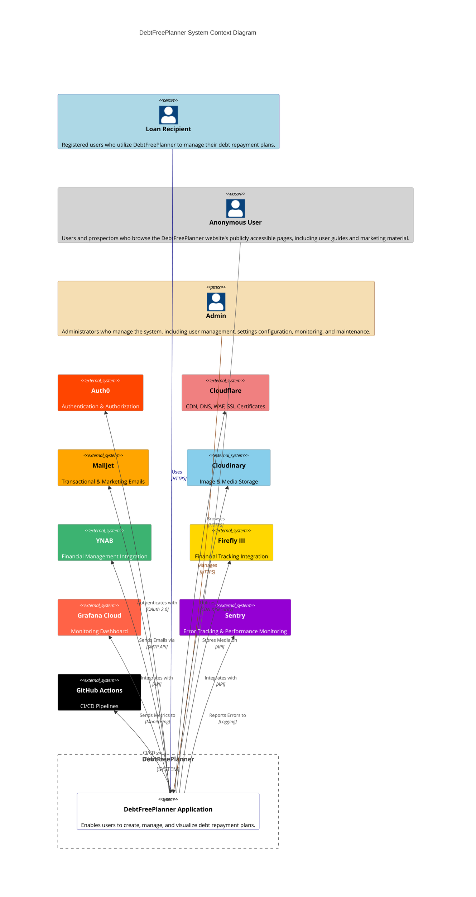
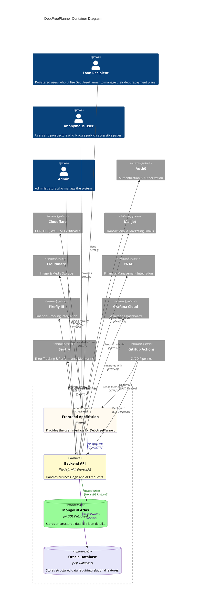

# Software Design Document (SDD)

## Introduction

The purpose of the Software Design Document (SDD) is to provide a comprehensive overview of the system's structure, components, and data design, facilitating a clear understanding among stakeholders and guiding the development process. It is developed based on the Product Requirements Document (PRD) following the Engineering Standards Guide.

Architecturally significant decisions are documented in an Architecture Decision Record (ADR).

## Table of Contents

- [Introduction](#introduction)
- [1. Infrastructure](#1-infrastructure)
  - [1.1. Compute](#11-compute)
  - [1.2. Secure Access Service Edge](#12-secure-access-service-edge)
  - [1.3. Data Persistence](#13-data-persistence)
  - [1.4. Observability](#14-observability)
  - [1.5. Repository and CI/CD Pipeline](#15-repository-and-cicd-pipeline)
  - [1.6. Email Service](#16-email-service)
  - [1.7. Authentication and Authorization](#17-authentication-and-authorization)
  - [1.8. Other Services](#18-other-services)
  - [1.9. Backup and Disaster Recovery](#19-backup-and-disaster-recovery)
- [2. Application Frameworks, Languages, and Libraries](#2-application-frameworks-languages-and-libraries)
  - [2.1. System Architecture and Design](#21-system-architecture-and-design)
  - [2.2. Frontend](#22-frontend)
  - [2.3. Backend](#23-backend)
  - [2.4. Content Moderation and PII Detection](#24-content-moderation-and-pii-detection)
- [3. Data Security and Privacy](#3-data-security-and-privacy)
  - [3.1. No Storage of PII](#31-no-storage-of-pii)
  - [3.2. Data Sanitization and Validation](#32-data-sanitization-and-validation)
  - [3.3. Data Encryption](#33-data-encryption)
  - [3.4. Data Deletion](#34-data-deletion)
- [4. Data Synchronization and Conflict Resolution Strategy](#4-data-synchronization-and-conflict-resolution-strategy)
  - [4.1. Context](#41-context)
  - [4.2. Data Structure](#42-data-structure)
    - [4.2.1. Version Tracking](#421-version-tracking)
    - [4.2.2. Timestamping](#422-timestamping)
  - [4.3. User Modification](#43-user-modification)
    - [4.3.1. Local Changes](#431-local-changes)
  - [4.4. Conflict Resolution](#44-conflict-resolution)
    - [4.4.1. Conflict Resolution Interface](#441-conflict-resolution-interface)
    - [4.4.2. Version Comparison Scenarios](#442-version-comparison-scenarios)
    - [4.4.3. Mid-Flight Conflict Handling](#443-mid-flight-conflict-handling)
  - [4.5. Synchronization Process](#45-synchronization-process)
    - [4.5.1. Notification Mechanism](#451-notification-mechanism)
    - [4.5.2. Rate Limiting Strategy](#452-rate-limiting-strategy)
    - [4.5.3. Retry Policies When Backend Is Down](#453-retry-policies-when-backend-is-down)
    - [4.5.4. Fail-Safe Synchronization](#454-fail-safe-synchronization)
    - [4.5.5. Data Retrieval](#455-data-retrieval)
  - [4.6. Additional Considerations](#46-additional-considerations)
    - [4.6.1. Soft Delete Implementation](#461-soft-delete-implementation)
    - [4.6.2. Handling Aged Datasets](#462-handling-aged-datasets)
    - [4.6.3. User Notifications](#463-user-notifications)
- [5. Licensing Overview](#5-licensing-overview)
  - [5.1. Licensing Tiers](#51-licensing-tiers)
    - [5.1.1. Free Tier](#511-free-tier)
    - [5.1.2. Premium Tier](#512-premium-tier)
    - [5.1.3. Professional Tier](#513-professional-tier)
  - [5.2. Additional Notes](#52-additional-notes)
- [6. Architecture Diagrams](#6-architecture-diagrams)
  - [6.1. Context Diagram](#61-c4-context-diagram)
  - [6.2. Container Diagram](#62-c4-container-diagram)
  - [6.3. Component Diagram](#63-c4-component-diagram)
  - [6.4. Code Diagram](#63-c4-component-diagram)
  - [6.5 Deployment Diagram](#65-c4-deployment-diagram)
- [7. Data Design](#7-data-design)
  - [7.1. Database Schemas](#71-database-schemas)
    - [Loans Data Storage](#loans-data-storage)

## 1. Infrastructure

### 1.1. Compute

**Compute Service:** Google App Engine (GAE)

- Built-in load balancing and auto-scaling features.

**Infrastructure as Code (IaC):** Google Cloud Deployment Manager

- Version-controlled templates using GitHub.
- GCP's budget monitoring tools to prevent unexpected costs.

### 1.2. Secure Access Service Edge

**Cloudflare Services:**

- DNS Hosting
- CDN
- WAF
- SSL Certificates (with fallback to Let's Encrypt)
- Domain name registration

### 1.3. Data Persistence

**NoSQL Database:** MongoDB Atlas (Free Tier)

- For unstructured data and document storage.

**SQL Database:** Oracle (Free Tier)

- For structured data requiring relational database features.

**SQLite:**

- For browser storage; alternatively, use IndexedDB.

### 1.4. Observability

**Monitoring Dashboard:** Grafana Cloud

- Centralizes logs, telemetry, and tracing from Cloudflare, GCP, and GitHub Actions.

**Error Tracking and Performance Monitoring:** Sentry

- Integrated into Grafana Cloud for comprehensive monitoring.

**Alerting and Incident Management:** PagerDuty

- For alerting and possibly hosting a status page.

### 1.5. Repository and CI/CD Pipeline

**Version Control:** GitHub

**CI/CD Pipelines:** GitHub Actions

- Automated builds, tests, and deployments.

**Automated Testing and Code Quality Tools:**

- **Unit and Integration Testing:** Jest
- **UI Component Testing:** Storybook
- **End-to-End (E2E) Testing:** Playwright
- **Linting and Formatting:** ESLint, Prettier
- **Code Quality Analysis:** SonarQube, Snyk

**Dependency Management Tools:** `npm audit` and GitHub Dependabot

### 1.6. Email Service

**Transactional Emails:** Mailjet

### 1.7. Authentication and Authorization

**Identity Provider (IdP):** Auth0

### 1.8. Other Services

**Web Analytics:** Google Analytics

**Secrets Management:** Google Cloud Secret Manager

- Integrated into GitHub Actions for CI/CD pipelines.

### 1.9. Backup and Disaster Recovery

**Repositories:**

- Regularly clone or pull updates to local storage using automated tools like `git` cron jobs.

**Databases:**

- **MongoDB Atlas:** Built-in backup tools or scheduled exports.
- **Oracle Free Tier:** Built-in backup or export functionality.

**Automation Tools:**

- Scripts for backup scheduling and management.

## 2. Application Frameworks, Languages, and Libraries

### 2.1. System Architecture and Design

**System Architecture:** 3-Tier Architecture

**Design Philosophy:** Local-First Approach

### 2.2. Frontend

**Language:** JavaScript

**Framework:** React

**Design Methodology:** Atomic Design

**UI Libraries and Tools:** Tailwind CSS

**Routing:** React Router

### 2.3. Backend

**Language:** JavaScript

**Framework:** Node.js with Express.js

**Design Methodology:** Layered Architecture

**API Design Style:** RESTful

**Security Middleware:** Helmet, Express-Rate-Limit

### 2.4. Content Moderation and PII Detection

**Libraries/Services:**

- `pii-detector` npm package or similar on the frontend.
- Google Cloud Data Loss Prevention (DLP) API on the backend.

## 3. Data Security and Privacy

### 3.1. No Storage of PII

The system shall not store any Personally Identifiable Information (PII), including:

- Full names
- Social Security Numbers (SSNs)
- Bank account details, including name and number

### 3.2. Data Sanitization and Validation

- **Frontend Checks:** The frontend checks for PII and ensures that the data is valid before submission. It verifies that all information needed to calculate a loan is present and performs calculations locally to ensure values are correct.
- **Backend Checks:** The backend performs additional checks before saving, using external entities such as Google's Sensitive Data Protection.

### 3.3. Data Encryption

**Data at Rest:**

- All data stored in MongoDB Atlas and Oracle databases is encrypted using AES-256 encryption.
- Client-side data persisted locally is stored securely using encryption mechanisms provided by the browser or additional libraries.

**Data in Transit:**

- TLS 1.2 or higher encryption for all data transmission between client and server.

### 3.4. Data Deletion

- **Soft Delete:** Data is soft-deleted and permanently deleted after 90 days, allowing users to recover accidentally deleted data.

## 4. Data Synchronization and Conflict Resolution Strategy

### 4.1. Context

In the DebtFreePlanner application, loan recipients typically spend 3 to 5 minutes entering a loan and about 1 minute updating a record. These activities occur once or twice a month per user. To ensure data integrity and a seamless user experience, the system implements the **Optimistic Concurrency Control** model to manage concurrent data access and modifications effectively. This strategy ensures data consistency across multiple devices and sessions, especially when users operate offline or experience intermittent connectivity.

### 4.2. Data Structure

To facilitate data synchronization and conflict detection, each document and its records follow a specific structure.

#### 4.2.1. Version Tracking

**Purpose:** Facilitates tracking and conflict detection by maintaining the version history of each record and document.

**Implementation:** Each record within a document, as well as the document itself, includes a version number. This number increments with every modification, allowing the system to detect potential conflicts.

#### 4.2.2. Timestamping

**Purpose:** Tracks the precise time when records and documents are last modified.

**Implementation:** Timestamps are recorded as epoch time.

```json
{
  "documentId": "doc123",
  "versionNumber": 5,
  "lastUpdatedAt": 1698754800,
  "records": [
    {
      "loanId": "loan001",
      "userId": "user123",
      "balance": 5000,
      "interestRate": 5.5,
      "monthlyPayment": 150,
      "currency": "USD",
      "versionNumber": 3,
      "lastUpdatedAt": 1698751200,
      "data": {
        /* Loan data */
      }
    }
    /* More records */
  ]
}
```

### 4.3. User Modification

#### 4.3.1. Local Changes

- **Optimistic Updates:** Changes made by loan recipients are applied immediately using optimistic updates, enhancing responsiveness by reflecting changes in the user interface without waiting for server confirmation.

- **Temporary Storage:** Local changes are temporarily stored on the client, encrypted, and queued for synchronization with the backend once the network connection is available or at scheduled intervals.

### 4.4. Conflict Resolution

#### 4.4.1. Conflict Resolution Interface

Conflicting record versions are displayed side by side, with differences highlighted. Loan recipients are prompted to select which version to retain, enabling manual conflict resolution and ensuring informed decision-making.

#### 4.4.2. Version Comparison Scenarios

- **Case 1:** Local Version < Database Version  
  **Action:** Log a warning and prompt the loan recipient for manual resolution.  
  **Reason:** The server has a more recent update than the local version.

- **Case 2:** Local Version == Database Version  
  **Action:** Log an informational message and proceed with the update.  
  **Reason:** No conflict detected; versions are in sync.

- **Case 3:** Local Version > Database Version  
  **Action:** Log an error and prompt the loan recipient for manual resolution.  
  **Reason:** Indicates potential data inconsistency or corruption, requiring user intervention.

#### 4.4.3. Mid-Flight Conflict Handling

- **Continue Updating:** Loan recipients can continue to make updates to a record, even if newer versions are received.

- **Version Change Detection:** If a new version of a record is received before initializing a synchronization process, the system checks for differences and initiates manual resolution if conflicts are detected.

### 4.5. Synchronization Process

#### 4.5.1. Notification Mechanism

**Publish-Subscribe Pattern:** The backend notifies all active online devices using a publish-subscribe (pub/sub) pattern to ensure data consistency across sessions. When changes are made to the dataset, all active devices are notified to update their local records accordingly.

#### 4.5.2. Rate Limiting Strategy

- **Fixed Window:** Up to six synchronization requests are allowed every five minutes.

- **Burst Capacity:** Two additional synchronization requests are allowed every ten minutes.

- **Cooldown Period:** After the synchronization request limit is exceeded, the system enters a five-minute cooldown period before allowing more requests.

#### 4.5.3. Retry Policies When Backend Is Down

- **Initial Retry Delay:** 30 seconds.

- **Exponential Backoff Factor:** 2.

- **Maximum Retry Attempts:** 3 attempts.

- **Maximum Retry Delay:** 2 minutes.

- **Randomized Cooldown:** Between 5 and 15 minutes after maximum attempts are reached.

#### 4.5.4. Fail-Safe Synchronization

- **Automatic Synchronization:** The application performs an automatic synchronization every 30 minutes, regardless of detected changes.

- **Error Logging:** If the client receives a dataset that is younger than three minutes compared to its own, it logs an error, indicating a potential failure in the publish-subscribe mechanism.

- **Data Corruption Handling:** If the dataset timestamps match but a record is out of sync, the system logs an error due to potential data corruption. A soft delete is performed on those records, and the loan recipient is notified.

- **Synchronization Cease Conditions:** After three consecutive synchronizations with no changes detected, the application assumes the loan recipient is inactive and ceases further synchronization to prevent unnecessary backend load.

#### 4.5.5. Data Retrieval

- **Upon Connection:** When the client reconnects to the network, it retrieves the latest version of the document from the server.

- **Download Entire Document:** The entire document (expected size: 0.01 to 0.03 MB) is downloaded during each synchronization event.

**Advantages:**

- **Data Integrity:** Ensures the entire dataset remains consistent with the source of truth, preventing partial or corrupted data states.

- **Simplicity:** Given the small data size, full synchronization is more efficient than implementing complex synchronization techniques like delta synchronization or conflict-free replicated data types (CRDTs).

### 4.6. Additional Considerations

#### 4.6.1. Soft Delete Implementation

- **Soft Delete:** Records marked for deletion are retained for up to 90 days before permanent removal.

- **Purpose:** Allows recovery of accidentally deleted records or those erroneously deleted by the synchronization process.

#### 4.6.2. Handling Aged Datasets

- **Old Data Deletion:** Clients coming online with data entries older than 45 days compared to the persistent layer will have those entries soft deleted, and the loan recipient will be notified.

- **Rationale:** It is unlikely the loan recipient still intends to use this outdated data, especially if they have worked with an updated dataset. However, the data is soft deleted in case it is still useful.

#### 4.6.3. User Notifications

- **Real-Time Updates:** Loan recipients receive toast notifications for any updates to their records, ensuring real-time awareness.

- **Deferred Notifications:** In cases of soft deletes or suspected data corruption, an email notification is sent to the loan recipient.

## 5. Licensing Overview

**DebtFreePlanner** offers a tiered licensing model to accommodate the varying needs of loan recipients. The licensing is structured to provide essential features in the free version, while offering enhanced capabilities in the paid tiers. This section outlines the limitations and features associated with each licensing level.

### 5.1 Licensing Tiers

#### 5.1.1 Free Tier

- **Number of Plans:**  
  Users can create up to **one debt repayment plan**.

- **Number of Loans per Plan:**  
  Each plan can include up to **three loans**.

- **Collaborators per Plan:**  
  Collaboration features are **not available** in the free tier.

- **Features Available:**
  - Access to basic repayment strategies (**Snowball**, **Avalanche**).
  - Basic reporting and visualizations.
  - **Snowflake payments**.
  - Data import/export functionality.
  - Basic **email support**.

#### 5.1.2 Premium Tier

- **Number of Plans:**  
  Users can create up to **five debt repayment plans**.

- **Number of Loans per Plan:**  
  Each plan can include up to **25 loans**.

- **Collaborators per Plan:**  
  Users can invite up to **five collaborators** per plan.

- **Features Available:**
  - All features from the **Free Tier**.
  - Access to additional repayment strategies (**Debt-to-Interest Ratio**, **Cash Flow Index**, **Custom Strategies**).
  - **Multicurrency support** with automatic exchange rate updates.
  - Integration with financial tools like **YNAB** and **Firefly III**.
  - **Snowflake payments**.
  - Data import/export functionality.
  - **Priority email support**.

#### 5.1.3 Professional Tier

- **Number of Plans:**  
  Users can create up to **ten debt repayment plans**.

- **Number of Loans per Plan:**  
  Each plan can include up to **50 loans**.

- **Collaborators per Plan:**  
  Users can invite up to **10 collaborators** per plan.

- **Features Available:**
  - All features from the **Premium Tier**.
  - Integration with financial tools like **YNAB** and **Firefly III**.
  - **Multi-user support** with **role-based access control**.
  - **Phone and email support**.

### 5.2 Additional Notes

- **Free 45-Day Trial for Premium Tier:**  
  Users will receive a **free 45-day trial** of the **Premium Tier** upon signing up.

- **Beta vs. Production Access:**  
  While the product is in **beta**, all users will have access to the **Premium Tier**. Once the product moves to **production**, users will have **90 days** to choose a suitable licensing plan.

## 6. Architecture Diagrams

### 6.1 C4 Context Diagram

The C4 Context Diagram provides a high-level overview of the DebtFreePlanner system, illustrating its interactions with primary users and external systems. This diagram serves as an entry point to understand the system's environment, key stakeholders, and its relationships with other components.

- **People (Actors)**

  - **Loan Recipient**: Registered users who use DebtFreePlanner to manage their debt repayment plans.
  - **Anonymous User**: Users and prospectors who browse publicly accessible pages of the DebtFreePlanner website, including user guides and marketing materials.
  - **Admin**: Administrators responsible for user management, settings configuration, monitoring, and maintenance of the system.

- **DebtFreePlanner System**

- **DebtFreePlannerSystem**: The core application that enables users to create, manage, and visualize debt repayment plans.

- **External Systems**

  - **Auth0**: Manages authentication and authorization processes.
  - **Cloudflare**: Provides CDN services, DNS management, WAF, and SSL certificates for security and performance.
  - **Mailjet**: Handles transactional and marketing emails sent from the application.
  - **Cloudinary**: Manages image and media storage for the application.
  - **YNAB**: Integrates financial management tools to enhance user budgeting capabilities.
  - **Firefly III**: Offers financial tracking and reporting features.
  - **Grafana Cloud**: Centralizes monitoring dashboards for system metrics.
  - **Sentry**: Provides error tracking and performance monitoring.
  - **GitHub Actions**: Facilitates CI/CD pipelines for automated builds, tests, and deployments.

- **Relationships**

  - **LoanRecipient → DebtFreePlannerSystem**: Uses the application over HTTPS to manage debts.
  - **AnonymousUser → DebtFreePlannerSystem**: Browses the website over HTTPS to access public content.
  - **Admin → DebtFreePlannerSystem**: Manages the system over HTTPS.
  - **DebtFreePlannerSystem → External Systems**: Interacts with various external services for authentication, security, email communication, media storage, financial integrations, monitoring, error tracking, and CI/CD pipelines.



### 6.2 C4 Container Diagram

The C4 Container Diagram provides a high-level overview of the software architecture for DebtFreePlanner, showing the major containers (applications, data stores, etc.) and how they interact. This diagram illustrates the internal structure of the DebtFreePlanner system and its interactions with external systems.

- **Actors**

  - **LoanRecipient**: Uses the frontend application to manage debt repayment plans.
  - **AnonymousUser**: Browses the publicly accessible pages via the frontend application.
  - **Admin**: Interacts directly with the backend API for management tasks.

- **Containers within DebtFreePlanner**

  - **Frontend Application (FrontendApp)**:

    - Built with React.
    - Provides the user interface and runs in the user's browser.
    - Communicates with the backend API via HTTPS.
    - Fetches media assets from Cloudinary.

  - **Backend API (BackendAPI)**:

    - Built with Node.js and Express.js.
    - Handles business logic and processes API requests.
    - Interacts with databases and external services.

  - **MongoDB Atlas (MongoDB)**:

    - Stores unstructured data like loan details.
    - NoSQL database accessed via MongoDB protocol.

  - **Oracle Database (OracleDB)**:
    - Stores structured data requiring relational features.
    - Accessed via SQL\*Net protocol.

- **External Systems**

  - **Auth0**: Manages user authentication and authorization.
  - **Cloudflare**: Provides CDN services and security features.
  - **Mailjet**: Handles sending emails.
  - **Cloudinary**: Manages media storage and delivery.
  - **YNAB and Firefly III**: Financial tools integrated via REST APIs.
  - **Grafana Cloud**: Collects monitoring metrics.
  - **Sentry**: Receives error logs and performance data.
  - **GitHub Actions**: Automates CI/CD pipelines for deployment.

- **Relationships**

  - **LoanRecipient** interacts with the **FrontendApp** over HTTPS.
  - **AnonymousUser** browses the **FrontendApp** over HTTPS.
  - **Admin** manages the system via the **BackendAPI**.
  - **FrontendApp** communicates with **BackendAPI** using JSON over HTTPS.
  - **BackendAPI** reads from and writes to both **MongoDB** and **OracleDB**.
  - **BackendAPI** authenticates users via **Auth0**.
  - **BackendAPI** sends emails through **Mailjet**.
  - **FrontendApp** fetches media assets from **Cloudinary**.
  - **BackendAPI** integrates with **YNAB** and **Firefly III**.
  - **BackendAPI** sends metrics to **Grafana Cloud** and errors to **Sentry**.
  - **GitHub Actions** deploys updates to both **BackendAPI** and **FrontendApp**.
  - **FrontendApp** is served through **Cloudflare** for CDN and security.



### 6.3 C4 Component Diagram

**Frontend:** This diagram will focus on the user experience, how components interact with each other and the backend API, and how external integrations like Cloudinary work.

**Backend:** This diagram will detail the backend's internal structure, showcasing controllers, services, repositories, and external systems. It will give more insight into the logic, data persistence, and communication with other services.

```mermaid
C4Component
    title DebtFreePlanner Component Diagram

    System_Boundary(DebtFreePlanner, "DebtFreePlanner") {

        %% Frontend Container
        Container_Boundary(FrontendApp, "Frontend Application", "React", "Provides the user interface for DebtFreePlanner") {

            %% Presentation Layer
            Boundary(FrontendPresentationLayer, "Presentation Layer", "Handles user interactions and UI rendering") {

                %% Public Pages
                Boundary(PublicPagesBoundary, "Public Pages") {
                    Component(HomePage, "Home Page", "Page", "Landing page for visitors")
                    Component(AboutPage, "About Page", "Page", "Information about the application")
                    Component(ContactPage, "Contact Page", "Page", "Contact information and form")
                    Component(PricePage, "Price Page", "Page", "Price information")
                }

                %% Private Pages
                Boundary(PrivatePagesBoundary, "Private Pages") {
                    Component(AdminPage, "Admin Page", "Page", "Admin-specific functionalities")
                    Component(AdminDashboardPage, "Dashboard Page", "Page", "Displays user-specific information")
                    Component(ProfilePage, "Profile Page", "Page", "Manage user profile and settings")
                    Component(AuthenticationPage, "Authentication Page", "Page", "Handles user authentication")
                    Component(PlanPage, "Plan Page", "Page", "Manage Plans")
                    Component(PlanDetailPage, "Plan Detail Page", "Page", "Manage Plan Details")
                }

                %% Relationships
                Rel(AuthenticationPage, UserManagementService, "Authenticates via", "OAuth 2.0")
            }

            %% Business Logic Layer
            Boundary(FrontendBusinessLogicBoundary, "Business Logic Layer") {
                Component(UserManagementService, "User Management Service", "Service", "Handles user authentication and account management")
                Component(DebtPlanEngine, "Debt Plan Engine", "Service", "Calculates debt repayment plans")

                %% Debt Plan Engine Components
                Boundary(DebtPlanEngineBoundary, "Debt Plan Engine Components") {
                    Component(PlanFactory, "Plan Factory", "Factory", "Creates repayment plans")
                    Component(LoanAmortization, "Loan Amortization", "Utility", "Calculates loan amortization schedules")
                    Component(PaymentCalculator, "Payment Calculator", "Utility", "Calculates payment installments")

                    %% Relationships within Debt Plan Engine
                    Rel(DebtPlanEngine, PlanFactory, "Uses")
                    Rel(PlanFactory, LoanAmortization, "Uses")
                    Rel(LoanAmortization, PaymentCalculator, "Uses")
                }

            }

            %% Service Logic Layer
            Boundary(FrontendServiceLogicLayer, "Service Logic Layer") {
                Component(APIService, "API Service", "Service", "Handles API requests and data fetching")
            }
        }

        %% Backend Container
        Container_Boundary(Backend, "Backend", "Node.js with Express.js", "Handles business logic and API requests") {

            %% Presentation Layer
            Boundary(BackendPresentationLayer, "Presentation Layer") {
                Component(APIRouter, "API Router", "Express Router", "Defines API endpoints")
                Component(AuthController, "Auth Controller", "Controller", "Handles authentication requests")
                Component(UserController, "User Controller", "Controller", "Handles user-related requests")
                Component(LoanController, "Loan Controller", "Controller", "Handles loan-related requests")
                Component(PlanController, "Plan Controller", "Controller", "Handles plan-related requests")
                Component(AdminController, "Admin Controller", "Controller", "Handles administrative tasks")

                %% Relationships within Presentation Layer
                Rel(APIRouter, AuthController, "Routes to")
                Rel(APIRouter, UserController, "Routes to")
                Rel(APIRouter, LoanController, "Routes to")
                Rel(APIRouter, PlanController, "Routes to")
                Rel(APIRouter, AdminController, "Routes to")
            }

            %% Business Logic Layer
            Boundary(BackendBusinessLogicLayer, "Business Logic Layer") {
                Component(AuthService, "Auth Service", "Service", "Manages authentication logic")
                Component_Ext(Auth0BackendComponent, "Auth0 (Backend)", "Auth0", "Handles backend authentication")
                Component(UserService, "User Service", "Service", "Manages user profiles")
                Component(LoanService, "Loan Service", "Service", "Handles loan operations")
                Component(PlanService, "Plan Service", "Service", "Processes repayment plans")
                Component(AdminService, "Admin Service", "Service", "Provides admin functionalities")
                Component(BusinessRules, "Business Rules", "Utility", "Contains business validations")

                %% Relationships within Business Logic Layer
                Rel(AuthService, Auth0BackendComponent, "Authenticates via", "OAuth 2.0")
                Rel(AuthController, AuthService, "Uses")
                Rel(UserController, UserService, "Uses")
                Rel(LoanController, LoanService, "Uses")
                Rel(PlanController, PlanService, "Uses")
                Rel(AdminController, AdminService, "Uses")
                Rel(AdminService, BusinessRules, "Uses")

                Rel(PlanService, PlanRepository, "Uses")
                Rel(AdminService, BusinessRules, "Uses")
            }

            %% Data Access Layer
            Boundary(DataAccessLayer, "Data Access Layer") {
                Component(PlanRepository, "Plan Repository", "Repository", "Accesses plan data")
                Component(LoanRepository, "Loan Repository", "Repository", "Accesses loan data")
                Component(UserRepository, "User Repository", "Repository", "Accesses user data")
                Component(DatabaseContext, "Database Context", "Utility", "Manages database connections")

                %% Relationships within Data Access Layer
                Rel(PlanRepository, DatabaseContext, "Uses")
                Rel(LoanRepository, DatabaseContext, "Uses")
                Rel(UserRepository, DatabaseContext, "Uses")
            }

            %% Utilities Layer
            Boundary(BackendUtilitiesLayer, "Utilities Layer") {
                Component(ValidationUtility, "Validation Utility", "Utility", "Validates data")
                Component(LoggingUtility, "Logging Utility", "Utility", "Logs application activities")
                Component(MonitoringUtility, "Monitoring Utility", "Utility", "Monitors system performance")
                Component(IntegrationUtility, "Integration Utility", "Utility", "Handles external integrations")

                %% Relationships within Utilities Layer
                Rel(ValidationUtility, ValidationLibrary, "Uses")
            }
        }

        %% Shared Utilities Container
        Container_Boundary(SharedUtilitiesBoundary, "Shared Utilities", "Utility", "Provides foundational services") {
            Component(ValidationLibrary, "Validation Library", "Utility", "Reusable validation functions")
            Component(CalculationLibrary, "Calculation Library", "Utility", "Reusable calculation functions")
            Component(ConflictDetectionLibrary, "Conflict Detection Library", "Utility", "Handles data conflicts")

            %% Relationships within Shared Utilities
            Rel(DebtPlanEngine, CalculationLibrary, "Uses")
            Rel(DebtPlanEngine, ConflictDetectionLibrary, "Uses")
        }

        %% External Databases Boundary
        Boundary(ExternalDatabasesBoundary, "External Databases") {
            ComponentDb_Ext(MongoDBComponent, "MongoDB Atlas", "NoSQL Database", "Stores unstructured data")
            ComponentDb_Ext(OracleDBComponent, "Oracle Database", "SQL Database", "Stores structured data")

            %% Relationships
            Rel(DatabaseContext, MongoDBComponent, "Connects to", "MongoDB Protocol")
            Rel(DatabaseContext, OracleDBComponent, "Connects to", "SQL*Net")
        }

        %% External Systems Boundary
       %% Container_Ext(ExternalSystemsBoundary, "External Systems") {

            Component_Ext(MailjetBackendComponent, "Mailjet", "Email Service", "Sends transactional emails")
            Component_Ext(YNABBackendComponent, "YNAB", "Financial Integration", "Integrates budgeting tools")
            Component_Ext(FireflyIIIBackendComponent, "Firefly III", "Financial Tracking", "Tracks financial data")
            Component_Ext(GrafanaCloudBackendComponent, "Grafana Cloud", "Monitoring Dashboard", "Visualizes system metrics")
            Component_Ext(SentryBackendComponent, "Sentry", "Error Tracking", "Monitors errors and performance")
       %% }

        %% Define Relationships - Backend to External Systems

        Rel(IntegrationUtility, MailjetBackendComponent, "Sends emails via", "SMTP API")
        Rel(IntegrationUtility, YNABBackendComponent, "Integrates with", "API")
        Rel(IntegrationUtility, FireflyIIIBackendComponent, "Integrates with", "API")
        Rel(MonitoringUtility, GrafanaCloudBackendComponent, "Sends metrics to", "HTTPS")
        Rel(LoggingUtility, SentryBackendComponent, "Reports errors to", "HTTPS")
        Rel(DebtPlanEngine, CalculationLibrary, "Uses")
        Rel(DebtPlanEngine, ConflictDetectionLibrary, "Uses")

        %% Define Manager and Related Services/Utilities
        %% Plan Management
        Boundary(PlanManagementBoundary, "Plan Management") {
            Component(PlanManager, "Plan Manager", "Manager", "Coordinates plan-related operations")
            Component(PlanValidationService, "Plan Validation Service", "Service", "Validates plan data")
            Component(PlanSynchronizationService, "Plan Synchronization Service", "Service", "Handles synchronization of plans")

            Rel(PlanManager, PlanService, "Uses")
            Rel(PlanManager, PlanValidationService, "Uses")
            Rel(PlanManager, PlanSynchronizationService, "Uses")
        }

        %% Debt Management
        Boundary(DebtManagementBoundary, "Debt Management") {
            Component(DebtManager, "Debt Manager", "Manager", "Coordinates debt-related operations")
            Component(DebtValidationService, "Debt Validation Service", "Service", "Validates debt data")
            Component(DebtSynchronizationService, "Debt Synchronization Service", "Service", "Handles synchronization of debts")

            Rel(DebtManager, LoanService, "Uses")
            Rel(DebtManager, DebtValidationService, "Uses")
            Rel(DebtManager, DebtSynchronizationService, "Uses")
        }

        %% Snowflake Management
        Boundary(SnowflakeManagementBoundary, "Snowflake Management") {
            Component(SnowflakeManager, "Snowflake Manager", "Manager", "Coordinates snowflake payment operations")
            Component(SnowflakeValidationService, "Snowflake Validation Service", "Service", "Validates snowflake payment data")
            Component(SnowflakeSynchronizationService, "Snowflake Synchronization Service", "Service", "Handles synchronization of snowflake payments")

            Rel(SnowflakeManager, PlanService, "Uses")
            Rel(SnowflakeManager, SnowflakeValidationService, "Uses")
            Rel(SnowflakeManager, SnowflakeSynchronizationService, "Uses")
        }

        %% Payment Management
        Boundary(PaymentManagementBoundary, "Payment Management") {
            Component(PaymentManager, "Payment Manager", "Manager", "Coordinates payment operations")
            Component(PaymentProcessingService, "Payment Processing Service", "Service", "Processes payments")
            Component(PaymentValidationService, "Payment Validation Service", "Service", "Validates payment data")

            Rel(PaymentManager, PaymentProcessingService, "Uses")
            Rel(PaymentManager, PaymentValidationService, "Uses")
        }

        %% Data Management
        Boundary(DataManagementBoundary, "Data Management") {
            Component(DataManager, "Data Manager", "Manager", "Coordinates data operations")
            Component(DataValidationService, "Data Validation Service", "Service", "Validates general data")
            Component(DataSynchronizationService, "Data Synchronization Service", "Service", "Handles data synchronization")

            Rel(DataManager, DataValidationService, "Uses")
            Rel(DataManager, DataSynchronizationService, "Uses")
        }

        %% Session Management
        Boundary(SessionManagementBoundary, "Session Management") {
            Component(SessionManager, "Session Manager", "Manager", "Handles user sessions")
            Component(SessionValidationService, "Session Validation Service", "Service", "Validates session data")
            Component(SessionSynchronizationService, "Session Synchronization Service", "Service", "Handles session synchronization")

            Rel(SessionManager, AuthService, "Uses")
            Rel(SessionManager, SessionValidationService, "Uses")
            Rel(SessionManager, SessionSynchronizationService, "Uses")
        }

        %% Subscription Management
        Boundary(SubscriptionManagementBoundary, "Subscription Management") {
            Component(SubscriptionManager, "Subscription Manager", "Manager", "Coordinates subscription operations")
            Component(SubscriptionValidationService, "Subscription Validation Service", "Service", "Validates subscription data")
            Component(SubscriptionSynchronizationService, "Subscription Synchronization Service", "Service", "Handles subscription synchronization")

            Rel(SubscriptionManager, PlanService, "Uses")
            Rel(SubscriptionManager, SubscriptionValidationService, "Uses")
            Rel(SubscriptionManager, SubscriptionSynchronizationService, "Uses")
        }

        %% Profile Management
        Boundary(ProfileManagementBoundary, "Profile Management") {
            Component(ProfileManager, "Profile Manager", "Manager", "Coordinates profile operations")
            Component(ProfileValidationService, "Profile Validation Service", "Service", "Validates profile data")
            Component(ProfileSynchronizationService, "Profile Synchronization Service", "Service", "Handles profile synchronization")

            Rel(ProfileManager, UserService, "Uses")
            Rel(ProfileManager, ProfileValidationService, "Uses")
            Rel(ProfileManager, ProfileSynchronizationService, "Uses")
        }

        %% Reporting Management
        Boundary(ReportingManagementBoundary, "Reporting Management") {
            Component(ReportingManager, "Reporting Manager", "Manager", "Coordinates reporting operations")
            Component(ReportingService, "Reporting Service", "Service", "Generates reports")
            Component(ReportingSynchronizationService, "Reporting Synchronization Service", "Service", "Handles report synchronization")

            Rel(ReportingManager, ReportingService, "Uses")
            Rel(ReportingManager, ReportingSynchronizationService, "Uses")
        }

        %% Integration Management
        Boundary(IntegrationManagementBoundary, "Integration Management") {
            Component(IntegrationManager, "Integration Manager", "Manager", "Coordinates external integrations")
            Component(IntegrationService, "Integration Service", "Service", "Manages integrations with external systems")
            Component(IntegrationSynchronizationService, "Integration Synchronization Service", "Service", "Handles integration synchronization")

            Rel(IntegrationManager, IntegrationService, "Uses")
            Rel(IntegrationManager, IntegrationSynchronizationService, "Uses")
        }

        %% Synchronization Management
        Boundary(SynchronizationManagementBoundary, "Synchronization Management") {
            Component(SynchronizationManager, "Synchronization Manager", "Manager", "Coordinates data synchronization across systems")
            Component(SynchronizationService, "Synchronization Service", "Service", "Handles data synchronization processes")
            Component(SynchronizationUtility, "Synchronization Utility", "Utility", "Provides synchronization helper functions")

            Rel(SynchronizationManager, SynchronizationService, "Uses")
            Rel(SynchronizationManager, SynchronizationUtility, "Uses")
        }

        %% Define Relationships to Shared Utilities
        Rel(PlanService, ValidationUtility, "Validates data with")
        Rel(LoanService, ValidationUtility, "Validates data with")
        Rel(UserService, ValidationUtility, "Validates data with")
        Rel(PlanService, CalculationLibrary, "Calculates repayment plans with")
        Rel(LoanService, CalculationLibrary, "Calculates loan schedules with")
        Rel(UserService, CalculationLibrary, "Calculates user data with")
        Rel(DebtPlanEngine, ConflictDetectionLibrary, "Uses")

        %% Define Relationships to External Systems
        Rel(IntegrationUtility, MailjetBackendComponent, "Sends emails via", "SMTP API")
        Rel(IntegrationUtility, YNABBackendComponent, "Integrates with", "API")
        Rel(IntegrationUtility, FireflyIIIBackendComponent, "Integrates with", "API")
        Rel(MonitoringUtility, GrafanaCloudBackendComponent, "Sends metrics to", "HTTPS")
        Rel(LoggingUtility, SentryBackendComponent, "Reports errors to", "HTTPS")
    }

    UpdateLayoutConfig($c4ShapeInRow="3", $c4BoundaryInRow="1")
```

### 6.3 C4 Code Diagram

Shows classes, interfaces, and their relationships within the codebase.

### 6.5 C4 Deployment Diagram

Shows the deployment

## 7. Data Design

### 7.1 Database Schemas

#### Loans Data Storage

**Database:** MongoDB Atlas

**Loan Document Structure:**

- `loanId`: Unique identifier
- `userId`: Reference to the user (non-PII)
- `balance`: Remaining balance
- `interestRate`: Annual interest rate
- `monthlyPayment`: Current payment amount
- `currency`: Currency code
- `versionNumber`: For conflict detection
- `lastUpdatedAt`: Timestamp for synchronization

**Client-Side Persistence:**

- Loans data is also persisted locally on the client using mechanisms like IndexedDB or LocalStorage for offline access and optimistic UI updates.
